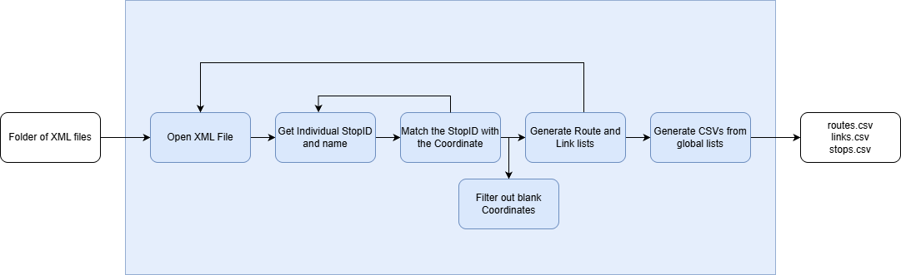
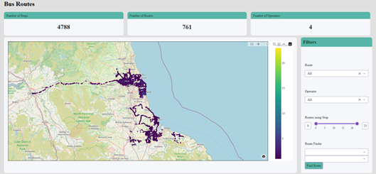

# Bus-Tracker
A web app made using Python to display the location of bus stops and routes using the UK Bus Open Data API.

## Data Collection
One script in the project scans through each XML file that the user has downloaded from the dataset to combine it into three CSV files that contain information about bus stops and routes.
  
The following image shows the pipeline that this script follows to collect this information. 
  
It loops through each information and gets the stopIDs, bus names and coordinates for each stop, as well as the route name, then adds the stop info to the stops.csv, the route info to the routes.csv and data to link these files in a links.CSV.

## Data Visualisation
The other script loads these CSV files to create an interactive web dashboard to display insights that can be gained from this information. 
  
The top of the app shows the total number of stops, routes and operators in the data, then there is an interactive map that each stop is plotted on. The user can filter for specific routes, operators or connectivity to see different stops.
  
If the user clicks on a stop, they can see information about that stop, such as the name and which routes and operators serve this stop.

